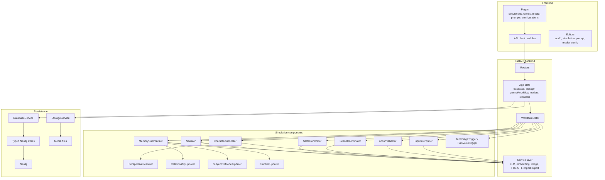

# Component Map

This page maps the major runtime components to their responsibilities. It is meant as a quick orientation before
reading the backend or persistence pages.

## Runtime component map

## Simulation components

| Component | Reads | Produces | Truth boundary |
| --- | --- | --- | --- |
| `InputInterpreter` | User text and current simulation context | Structured candidate user actions or OOC detection | Proposal only. |
| `ActionValidator` | Proposed actions and graph state | Validation results and rework feedback | Proposal only. |
| `CharacterSimulator` | Private `CharacterPerspective` | Character action or reaction proposals | Proposal only. |
| `PerspectiveResolver` | Graph perception candidates | Actor-scoped perceived entities | Private context. |
| `SceneCoordinator` | Valid action plans and reaction history | Accepted action timeline or coordination problem | Proposal only. |
| `StateCommitter` | Accepted actions | `StateCommitProposal` operations | Truth only after store application. |
| `MemorySummarizer` | Committed turn, observers, state commit | Events, memories, intent updates | Derived truth after memory store application. |
| `RelationshipUpdater` | Memories and perspective evidence | Relationship proposals | Derived truth after store application. |
| `SubjectiveModelUpdater` | Memories and observer context | Private subjective claim proposals | Private derived truth after store application. |
| `EmotionUpdater` | Memories, actions, character state | Private emotion vector update | Private derived truth after store application. |
| `Narrator` | Accepted or committed turn context | `NarrationProposal` / presentation text | Display layer, not physical truth. |
| `ActionSuggester` | Recent turn context | Suggested user actions | UI aid only. |

## Service components

| Service | Responsibility |
| --- | --- |
| `LlmService` | Compose prompt messages, call chat providers, and repair structured output. |
| `EmbedService` | Call embedding providers for memory and intent retrieval. |
| `ImageService` | Submit image prompts to ComfyUI-compatible image backends. |
| `TurnImageTrigger` | Decide and run turn or entity image generation as a side effect. |
| `TurnVoiceTrigger` | Run configured TTS generation for turn presentation segments as a side effect. |
| `StorageService` | Store and retrieve content-addressed media and JSON artifacts. |
| `AuditService` | Record structured audit events for generation, validation, coordination, commit, time, and errors. |

## Configuration flow

Provider connections, model configs, prompt assignments, workflow assignments, and per-component bindings are stored
in Neo4j. Simulation components load their assigned configuration at runtime. This means the same code path can use
different models for interpretation, character proposal, coordination, narration, image prompt building, and media
generation.
