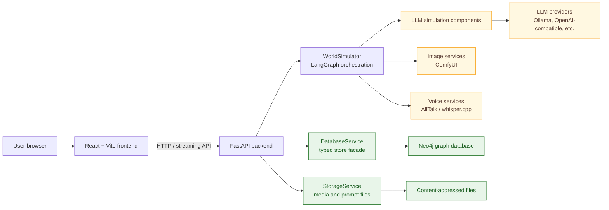

# Architecture

World Simulation Engine is a local-first simulation application with a React frontend, a FastAPI backend, a Neo4j
graph database, and a LangGraph-orchestrated simulation pipeline. The core design choice is that prose is not the
source of truth. LLM components propose structured actions, state changes, memories, and narration, while code owns
routing, validation, graph persistence, time advancement, and audit records.

This section expands the short README summary into the main architectural views:

| Page | What it covers |
| --- | --- |
| [Simulation lifecycle](simulation-lifecycle.md) | How one user turn moves from text to proposed actions, committed graph state, memory updates, narration, and presentation. |
| [Component map](component-map.md) | The main runtime components and which layer owns each responsibility. |
| [Backend](backend.md) | FastAPI startup, routers, services, provider adapters, and generation streaming. |
| [Frontend](frontend.md) | React/Vite page structure and how the UI maps to backend resources. |
| [Persistence](persistence.md) | Neo4j stores, media storage, committed truth, snapshots, audit records, and derived cognition. |
| [Background simulation](background-simulation.md) | How foreground user turns coexist with off-scene character activity. |

## System containers

The frontend never talks directly to Neo4j or provider APIs. It calls the backend, and the backend resolves the
configured providers, model profiles, prompts, workflows, and graph state for each operation.

## Boundaries

| Boundary | Owned by | Notes |
| --- | --- | --- |
| Browser state and interaction | Frontend | Routing, editors, chat view, media controls, configuration forms. |
| API contract | FastAPI routers | Resource endpoints for worlds, simulations, entities, configuration, media, prompts, turns, and generation runs. |
| Simulation orchestration | `WorldSimulator` | Builds and runs LangGraph graphs, manages run locks, snapshots, off-scene queues, and side-effect triggers. |
| LLM behavior | Component prompts and model configs | Components produce structured outputs, usually repaired and validated before use. |
| Committed truth | Neo4j stores | Physical state, turns, memories, relationships, subjective claims, emotion, config, audit, and snapshots. |
| Binary or JSON media | `StorageService` plus media graph nodes | Images, voice files, prompt media, and workflow media are stored outside Neo4j and linked from graph records. |

## Core principle

The simulator distinguishes three kinds of data:

- **Private context**: scoped character perspective, memories, relationships, subjective claims, and emotion used to
  make a proposal.
- **Proposed state**: structured LLM output that can be validated, coordinated, repaired, rejected, or reworked.
- **Committed truth**: graph mutations and turn records written through the database services.

The most important architecture rule is that LLM output does not become truth merely because it was generated. It
becomes truth only after the validator, scene coordinator, state committer, and database commit path accept it.
