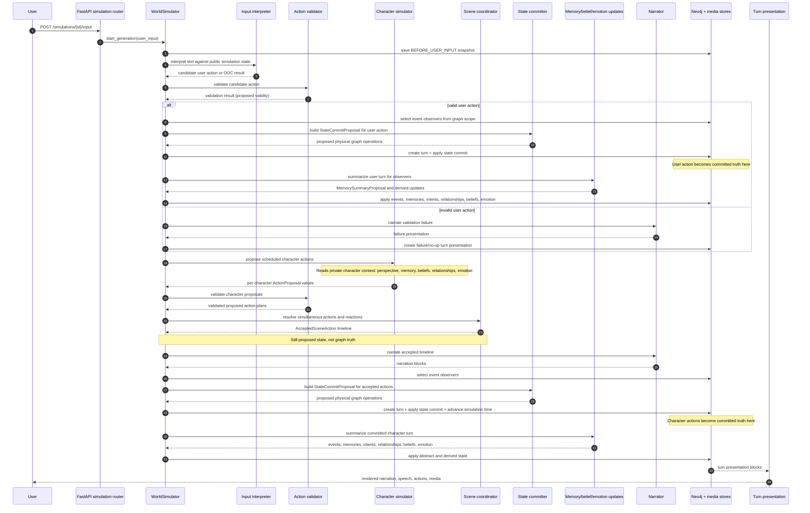

# Simulation Lifecycle

A simulation generation is a background job started by the simulation API. For a normal user turn, the job runs the
user-input LangGraph in `WorldSimulator`. Continuation and regeneration use the character-round graph restored from a
saved graph state snapshot.

## One-turn sequence

This diagram shows the intended data boundary for a normal turn. The exact graph can branch for invalid input,
out-of-character commands, reaction rounds, or no scheduled character activity, but the truth boundary is the same:
candidate and proposed data remain provisional until state commit applies accepted operations.

## State phases

| Phase | Examples | Truth status |
| --- | --- | --- |
| Interpretation | `InputInterpretation`, candidate `ProposedAction` | Not truth. It is a parsed proposal. |
| Validation | `ActionValidationResult` | Not truth. It decides whether proposals may continue. |
| Character proposal | `ActionProposal`, `CharacterActionPlan` | Not truth. It is private-context output from one actor. |
| Coordination | `SceneCoordinationResult`, `AcceptedSceneAction` | Not truth. It is the accepted timeline to commit. |
| Physical commit proposal | `StateCommitProposal` | Not truth until applied by the database store. |
| Physical commit | `Turn`, graph entity/relationship mutations, `Simulation.current_time` | Committed truth. |
| Abstract memory commit | `MemorySummaryProposal`, events, memories, intents | Committed derived truth after memory summary store applies it. |
| Presentation | `TurnPresentationRendering` | Display layer derived from committed turns and narration. |

## Private context

Private character context is read during character proposal, reaction proposal, relationship updates, subjective
model updates, and emotion updates. It should not be treated as globally visible state. A character prompt receives a
scoped `CharacterPerspective`, not the full graph. That perspective can include private memories, subjective claims,
private relationship descriptions, and emotion, but those are only made visible to the actor whose context is being
built.

## Snapshots and regeneration

`WorldSimulator` saves graph state snapshots before user input and after generation base points. Continuation and
regeneration load those snapshots instead of trying to reconstruct execution state from narration. This keeps reruns
grounded in structured graph state and the simulator's own intermediate state.
