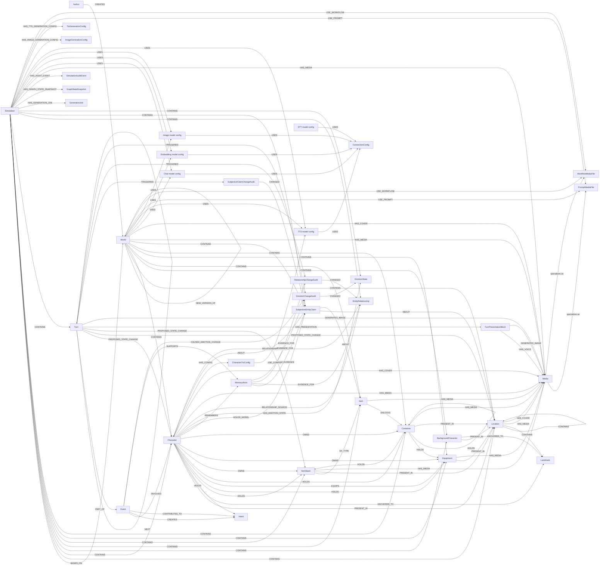

# Data Model

World Simulation Engine stores narrative state as structured graph data. The graph is not only persistence; it is the working memory that lets simulation components answer questions such as who is present, what a character privately believes, which memories support a relationship, and which generated media belongs to a turn.

This section is a contributor reference for the main node labels, relationships, lifecycle rules, and API surfaces.

## Model families

| Area | Documents | Primary labels |
| --- | --- | --- |
| World structure | [World and location](world-and-location.md) | `Author`, `World`, `Simulation`, `Location`, `Landmark` |
| People | [Characters](characters.md) | `Character`, `BackgroundCharacter`, `Intent`, `CharacterTtsConfig` |
| Physical state | [Items and containers](items-and-containers.md) | `Item`, `ItemStack`, `Equipment`, `Container` |
| Turn history | [Events, turns, and actions](events-turns-and-actions.md) | `Turn`, `TurnPresentationBlock`, `Event`, `Intent`, `GenerationJob`, `GraphStateSnapshot`, `SimulationAuditEvent` |
| Memory and belief | [Memories and claims](memories-and-claims.md) | `MemoryAtom`, `SubjectiveEntityClaim`, `SubjectiveClaimChangeAudit` |
| Social state | [Relationships and emotions](relationships-and-emotions.md) | `EntityRelationship`, `EmotionState`, `RelationshipChangeAudit`, `EmotionChangeAudit` |
| Assets and service config | [Media and configuration](media-and-configuration.md) | `Media`, `ConnectionConfig`, model config nodes, generation config nodes |

## Complete entity-relationship diagram

## Cross-cutting rules

- `World` is the reusable authored template. `Simulation` is the mutable run state based on a world.
- Most authored and runtime entities are connected from a `World` or `Simulation` with `CONTAINS`.
- Simulations can read inherited world data through `BASED_ON`, but runtime mutations are committed into the simulation graph.
- Physical placement is exclusive in normal state: an object is either in a location, held/equipped by another entity, or contained by a container.
- Turns record proposals with `PROPOSED_STATE_CHANGE`; the graph becomes committed truth only when the state committer writes the proposed changes.
- Private context is modeled on character fields, subjective claims, relationship visibility, memories, and emotion state. Presentation APIs should expose only the appropriate rendered view.
