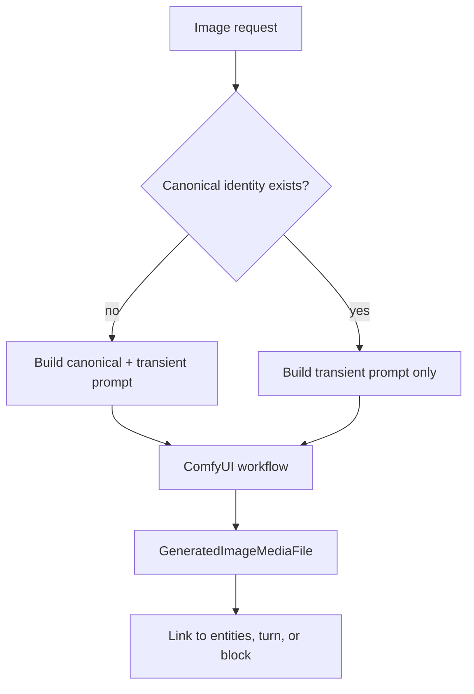

# Image Generation

World Simulation Engine treats images as generated media linked back to the graph. Images are not just files in a folder: generated image records store the component, workflow name, canonical identity tags, transient tags, negative prompt, and links to entities, turns, or presentation blocks.

The implementation is split between per-target image generator components and a turn-level trigger.

## Generation targets

| Target | Component | What it depicts |
| --- | --- | --- |
| Character state image | `CharacterImageGenerator` | A standalone reference/state portrait of one character on a neutral background. |
| Character portrait | `CharacterPortraitImageGenerator` | One character in their current location, optionally grounded by a turn or presentation block. |
| Location state image | `LocationImageGenerator` | A wide establishing image of one location without characters. |
| Item state image | `ItemImageGenerator` | A standalone product-style image of one item. |
| Scene image | `SceneImageGenerator` | The current characters in one location, grounded by optional turn narration. |

State images can use a world or simulation as `source_id`, because they only need model, prompt, and workflow configuration. Portrait and scene images are simulation-scoped because they depend on live character location and current scene state.

## Manual generation

Manual generation is explicit and user-driven. The API exposes endpoints for:

- character, location, and item state images,
- character portraits inside a simulation,
- scene images for a simulation location.

Turn-grounded requests can include a `turn_id` and an optional `block_id`. When present, generated media is linked to the whole turn or to a specific presentation block, which lets the frontend show the image beside the exact narration/action/speech segment that requested it.

## Automatic generation

Automatic turn images are controlled by `ImageGenerationConfig`:

| Mode | Behavior |
| --- | --- |
| `manual` | No automatic generation. Images are only generated from explicit requests. |
| `auto` | The turn is checked for visual significance. Significant turns generate a scene image. |
| `always` | Every committed turn attempts to generate a scene image. |

In `auto` mode, `TurnImageTrigger` first applies a deterministic action-type check. Movement, attacks, item manipulation, posture changes, and similar physical changes are significant. Waiting, speech-only, observing, and looking are normally insignificant. If the action types are inconclusive, the `turn_image_trigger` LLM component makes the decision.

`fallback_turns` prevents long stretches without fresh imagery. If enough turns have passed since the last generated turn image, `auto` mode forces a scene generation even when the significance check says no.

## Canonical and transient image prompts

The image pipeline separates permanent identity from momentary state:

- Canonical identity captures stable visual traits: character appearance, fixed object traits, or durable location features.
- Transient prompt content captures the current pose, expression, clothing, lighting, relationship, action, or scene moment.

The first generated cover image establishes canonical identity. Later generations reuse it and ask the LLM only for transient prompt content. Composite images, such as portraits and scenes, first ensure every participant has canonical identity, then combine those identities with fresh turn-grounded transient details.

## Configuration

Each image target uses both:

- a chat model config for prompt building or turn significance,
- an image model config for ComfyUI workflow execution.

The component assignment matters. A simulation may use one LLM for normal narration, another small model for `turn_image_trigger`, and a separate image config for `scene_image_generator`.

Automatic generation is fire-and-forget. Failures are logged and swallowed so image backend problems do not break the core turn pipeline.
