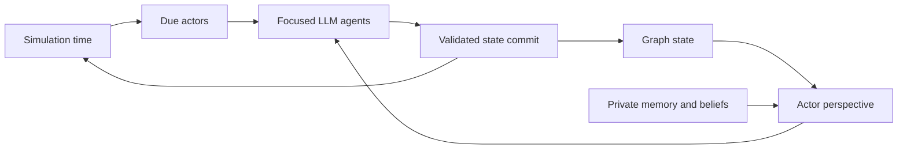

# Features

World Simulation Engine is built around four related design choices:

- Time advances inside the simulated world, not just by chat-message count.
- The world state is stored as typed graph data, not as one transcript or a set of disconnected tables.
- Simulation is split across multiple focused LLM agents, each with a narrow job and its own model configuration.
- Characters act from scoped perspectives, with private memories and beliefs instead of omniscient access to canonical state.

These features are implemented together. The scheduler asks who is due to act at the current simulation time. Each actor receives a perspective built from graph state, perception resolution, relationships, memory recall, intents, and private emotional constraints. The selected agents propose, validate, coordinate, narrate, and commit only structured changes. The graph then becomes the next source of truth.

Read these sections for the details:

- [Time-based simulation](time-based-simulation.md)
- [Structured graph data](structured-graph-data.md)
- [Multi-agent flow](multi-agent-flow.md)
- [Perspective and memory](perspective-and-memory.md)
- [Image generation](image-generation.md)
- [TTS and STT](tts-and-stt.md)
- [Turn presentation](turn-presentation.md)
