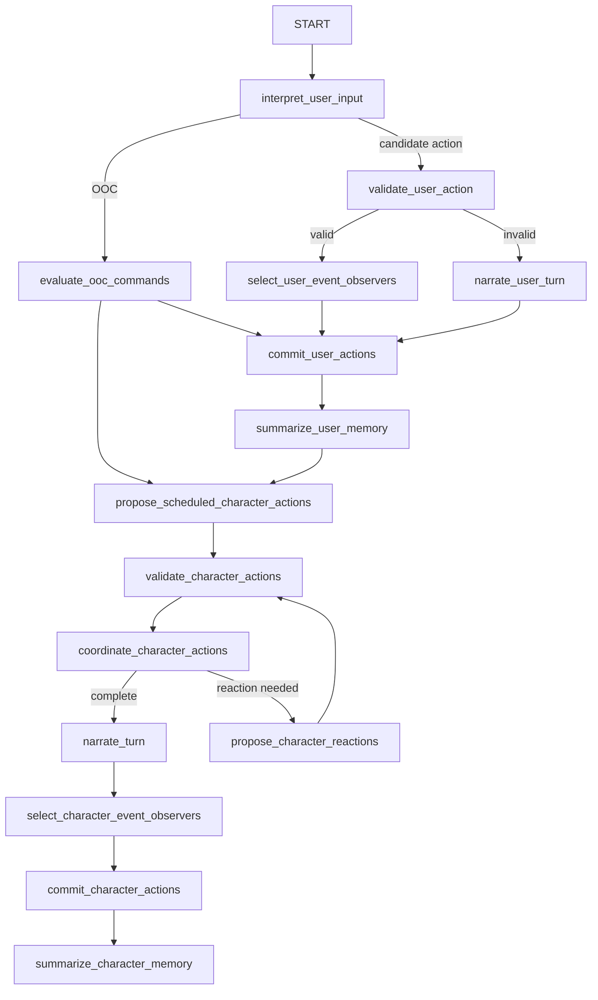

# Multi-agent Flow

World Simulation Engine does not use one all-purpose prompt to decide everything. It uses a set of focused LLM-backed components, each responsible for one stage of the simulation. The orchestration lives in `WorldSimulator`, which builds LangGraph state graphs for user-input generations and character-round generations.

Each component inherits the shared `SimulatorComponent` behavior:

- It declares a `ComponentType`.
- It loads the chat model assigned to that component for the current simulation.
- It loads the prompt assigned to the component and world language.
- It receives structured context.
- It returns structured output, usually through `LlmService.invoke_structured_with_repair`.

This allows different pipeline stages to use different providers, models, prompts, and generation parameters.

## Agents and responsibilities

| Component | Purpose | Activated when |
| --- | --- | --- |
| `InputInterpreter` | Turns user text into structured candidate actions or detects that the input is out-of-character. | Start of a user-input generation. |
| `OOCHandler` | Evaluates out-of-character commands and can produce world-state mutations or forced actions. | After input interpretation marks input as OOC. |
| `ActionValidator` | Checks whether proposed user or character actions are valid in the current state. | After user action interpretation or character action proposal. |
| `CharacterSimulator` | Builds a character perspective and proposes actions or reactions for one actor. | Scheduled character rounds, reaction rounds, off-scene activity, and action suggestions. |
| `SceneCoordinator` | Resolves simultaneous or conflicting valid action plans into accepted actions, pending actions, or problems. | After validated action proposals exist. |
| `Narrator` | Turns accepted, committed events into user-facing narration or failure text. | After coordination or validation failure. |
| `StateCommitter` | Converts accepted actions into physical graph mutations. | After coordination accepts actions. |
| `MemorySummarizer` | Converts committed turns into events, memories, and intent changes. | After physical commit. |
| `PerspectiveResolver` | Builds what one character can perceive from the graph and resolver prompts. | Inside character action/reaction proposal. |
| `RelationshipUpdater` | Updates first-class relationship records from new memories and perspective evidence. | During post-turn memory/relationship processing. |
| `SubjectiveModelUpdater` | Updates private entity claims held by a character. | During post-turn memory/relationship processing. |
| `EmotionUpdater` | Updates private emotion state used as a soft constraint. | During post-turn character state processing when emotions are enabled. |
| `ActionSuggester` | Produces suggested user actions without changing committed state. | In parallel after a user or character turn is ready to present. |
| `SemanticTriggerEvaluator` | Judges dormant triggers' free-text conditions against a just-committed turn's narration and memories; deterministic (time/location/variable) conditions are checked in code, not by this component. | Best-effort, after a turn is committed and memory-summarized, run by `TriggerEngine`. |

Image and voice generators follow the same overall pattern but run as media side effects rather than core state simulation.

## User-input graph

User input starts with interpretation and then routes based on the result:

The graph can also end early when there is no valid user action or no scheduled character action.

## Character-round graph

Character rounds are used for continuation, regeneration, and scheduled non-user activity. They begin directly at `propose_scheduled_character_actions`, then follow validation, coordination, narration, commit, and memory summary.

This is why the simulator can continue after a user turn without another user message. The active simulation time and character activities decide whether anyone is due to act.

## Concurrency and fan-out

When multiple independent actors or resolver calls are needed, the implementation uses LangGraph `Send` fan-out patterns:

- Character action proposals can run independently per actor.
- Perspective resolution can fan out across perceived characters, background characters, items, equipment, containers, and landmarks.
- A small reusable fan-out subgraph restores deterministic output order after concurrent execution.

The concurrency is bounded by scheduler limits and by the graph structure. The final committed result still passes through validation, coordination, and one state commit path.

## Routing and repair

Agents produce structured models, not arbitrary prose. Several models include validators that repair common local-model mistakes, such as missing discriminator fields. `LlmService.invoke_structured_with_repair` gives components a second chance to return valid structured output.

Routing is explicit:

- Validation can route to failure narration, rework, or coordination.
- Coordination can route to completion, reaction, user decision, or stop.
- Memory summary can route to another character round if scheduled characters are due.
- Snapshot-backed continuation and regeneration restore graph state before running a character round.

The result is a pipeline where LLMs make bounded decisions, while code owns orchestration, persistence, timing, and invariants.
