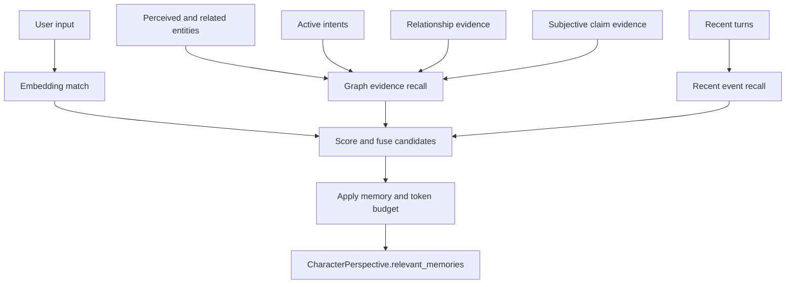

# Perspective, Memory, and Recall

Characters in World Simulation Engine do not receive one global block of canonical information. They receive a scoped perspective built for that actor at the current simulation time. That perspective combines what the actor can perceive, what they remember, what they currently intend, what relationships are available to them, and what private beliefs they hold.

This is implemented in `CharacterSimulator._build_perspective`.

## What goes into a perspective

`CharacterPerspective` contains:

| Field | Meaning |
| --- | --- |
| `actor` | The character whose point of view is being built. |
| `world_time` | The current simulation clock. |
| `location` | The actor's current location. |
| `inventory` / `equipment` | Items and equipment directly available to the actor. |
| `intents` | Active or semantically recalled goals owned by the actor. |
| `perceived_*` | Entities the actor can currently perceive, resolved by type. |
| `relevant_memories` | A bounded set of recalled memories for this actor. |
| `relationships` | Objective/public/private relationships available from this actor's perspective. |
| `subjective_claims` | Private beliefs this actor holds about nearby or relevant entities. |
| `emotion` | Optional private emotion vector used as a soft constraint. |

The action proposal prompt receives this context, not the whole database.

## Perception before recall

The `PerspectiveResolver` first gathers graph candidates from the actor's local scope:

- characters visible through contained-location traversal,
- background characters in the current location,
- item stacks in the current location,
- equipment in the current location,
- containers in the current location,
- landmarks in the current location.

Then it fans out type-specific resolver prompts. These return `visibility`, `distance_hint`, `affordances`, `salience`, and notes for each perceived entity. Visible equipment on visible characters is attached after character perception resolves.

This gives the simulator two layers of filtering:

1. Graph traversal decides what could plausibly be perceived.
2. The resolver decides what the actor actually notices and how it appears.

## Memory model

A `MemoryAtom` is a small recallable unit with a summary, keywords, and optional embedding. It is not globally owned. It is connected to:

- an `Event` through `SUPPORTS`, including the kind of support,
- one or more `Character` nodes through `REMEMBERS`,
- per-character memory metadata on the `REMEMBERS` relationship: confidence, salience, behavioral relevance, and stance.

This means two characters can remember the same event differently, or one can remember it while another does not. The memory itself may be shared as evidence, but access to it is character-scoped.

## Recall channels

`MemoryRetriever` combines several recall channels before applying a prompt budget:

| Channel | What it captures |
| --- | --- |
| `recent_event` | Memories from the most recent turns. |
| `entity_neighborhood` | Memories connected to currently relevant entities. |
| `active_intent` | Memories tied to active or paused intents. |
| `relationship_evidence` | Memories supporting relationships involving relevant entities. |
| `portrait_evidence` | Memories supporting private subjective claims about relevant entities. |
| `embedding_match` | Semantically similar memories when there is user input to embed. |

Candidates receive channel scores, decayed confidence, temporal proximity, and salience boosts. They are sorted by channel priority and fusion score, then selected until the max memory count or token budget is reached. The default retrieval budget is intentionally small, so a character gets a focused memory set instead of a transcript dump.

## Intents and emotion

Intents are also scoped to characters through `HOLDS`. The simulator recalls intents by deadline, priority, urgency, and semantic match against user input. When emotion is enabled, private emotion can slightly bias needs and reactions by increasing priority or urgency without mutating the canonical intent.

Emotion is used as a soft constraint for tone, risk tolerance, interruption behavior, and urgency. Prompts explicitly instruct components not to expose private numeric emotion values.

## Private beliefs and relationships

The system separates relationship records from subjective claims:

- `EntityRelationship` is a first-class relationship node between two entities. It can be objective, public, or private to one perspective, and it keeps evidence memory ids plus version history.
- `SubjectiveEntityClaim` is a private model one observer holds about another entity. It has a category, statement, stance, confidence, supporting evidence, contradicting evidence, version, and active flag.

Subjective claim queries deliberately require an observer. There is no omniscient "list everyone knows" recall path for character action prompts.

## Why this is better than giving everyone canonical info

If every character prompt receives all canonical state, then every character implicitly knows secrets, distant events, hidden motives, and facts they should only infer. Prompt instructions can say "do not use this", but the information is still in context.

The scoped approach has different properties:

- Hidden information stays out of the actor's prompt unless perception, memory, or belief justifies it.
- Misunderstandings and false beliefs can persist as first-class state.
- Memories decay and compete for limited prompt budget.
- Evidence links explain why a character believes or recalls something.
- Two characters can form different models of the same event or person.
- Narration can be generated from committed state without forcing every actor to share the same knowledge.

This is more expensive than a global context dump, but it is the main reason the simulation can support private knowledge, partial perception, and character-specific continuity.
