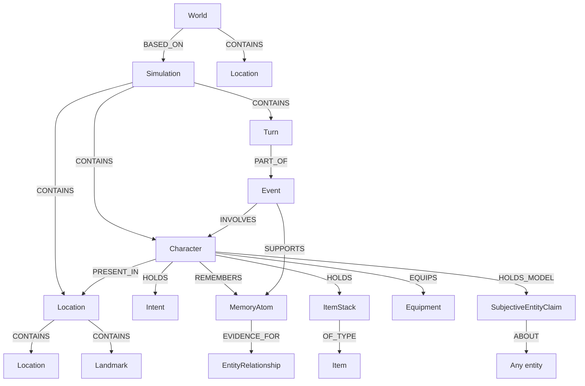

# Structured Graph Data

World Simulation Engine stores the simulated world as typed graph data in Neo4j. Text narration is an output layer, not the source of truth. Characters, locations, items, events, memories, intents, relationships, turns, media, and configuration are all represented as nodes and relationships that can be queried directly.

## Core shape

The exact database schema is implemented through store classes under `service/database`, with Pydantic models under `model`. The graph is intentionally domain-shaped rather than table-shaped.



Some relationships represent physical state, such as `PRESENT_IN`, `HOLDS`, `OWNS`, `EQUIPS`, `CONTAINS`, `PART_OF`, and `OF_TYPE`. Others represent provenance or cognition, such as `SUPPORTS`, `REMEMBERS`, `EVIDENCE_FOR`, `CLAIM_EVIDENCE`, `HOLDS_MODEL`, `CREATES`, and `CONTRIBUTES_TO`.

## Why a graph

A role-play world is relationship-heavy:

- A location may contain nested locations, landmarks, characters, containers, item stacks, and equipment.
- A character can own, hold, wear, remember, believe, intend, perceive, and relate to many entities at once.
- A memory belongs to an event, but different characters can remember that same memory with different confidence, salience, stance, and behavioral relevance.
- A relationship can be objective, public, or private to one character, and can carry evidence memories.
- A turn can be linked to an event, the event can support memories, and those memories can later update beliefs or relationships.

In a normal relational design, these structures become many join tables and repeated multi-hop joins. That works for fixed business records, but it becomes brittle for simulation because every query asks "what is connected to this actor in this world, from this perspective, through these evidence paths?"

Neo4j lets the implementation express that directly. For example, the database service can ask for characters perceivable by an observer using a contained-location traversal:

```cypher
MATCH (observer:Character {id: $observer_id})-[:PRESENT_IN]->(observer_location:Location)
MATCH (observer_location)-[:CONTAINS*0..]->(location:Location)
MATCH (character:Character)-[present:PRESENT_IN]->(location)
```

That is not just a storage detail. It makes perception, ownership, location scope, memory evidence, and simulation inheritance natural query shapes.

## Physical state and abstract state are separate

The state committer handles physical graph changes through `StateCommitProposal`. These operations create entities, change fields, promote entities, and change relationships. The model intentionally excludes events, memories, and intents from this physical commit path.

Abstract state is handled by `MemorySummaryProposal`. It can create or update events, memories, and intents, and link turns to events. This separation matters because "a door opened" and "Alice remembers Bob betrayed her" are different kinds of state:

- Physical state changes affect what can happen next.
- Abstract state changes affect what characters recall, believe, and choose.
- Both are grounded in the committed turn, but they are not merged into one vague prose summary.

## Provenance and auditability

Committed graph changes are linked back to turns. State commit operations use `Turn` relationships such as `PROPOSED_STATE_CHANGE`, while memory and relationship systems keep evidence links and version/audit records.

This makes the graph useful for debugging and regeneration:

- You can inspect which turn changed an entity.
- You can ask which event supports a memory.
- You can ask which memories support a relationship or subjective claim.
- You can copy a world into a simulation while remapping entity ids.
- You can snapshot graph-generation state and restore it for continuation or regeneration.

## Why it is more powerful than a relational design here

The advantage is not that graph databases are universally better. It is that the simulation domain is mostly composed of typed entities plus evolving relationships.

| Need | Relational shape | Graph shape |
| --- | --- | --- |
| Nested places and visibility scope | Recursive joins or closure tables | `CONTAINS*0..` traversal |
| Character inventory and equipment | Multiple join tables with different semantics | `HOLDS`, `OWNS`, `EQUIPS`, `PRESENT_IN` edges |
| Event-backed memories | Event table, memory table, join table, character-memory join table | `Turn -> Event -> Memory`, `Character -> Memory` |
| Private beliefs | Extra perspective columns across many tables | Observer-owned `SubjectiveEntityClaim` nodes |
| Evidence-backed relationships | Relationship rows plus evidence joins | First-class `EntityRelationship` nodes linked to endpoints and memory evidence |
| Scoped recall | Many joins with world/simulation filters | Path-constrained traversal from `World` or `Simulation` |

The graph keeps the world inspectable in the same shape that the simulator reasons about it.
