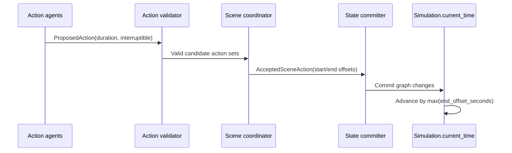

# Time-based Simulation

Most chat systems advance by message count: the user sends a message, the model replies, and that exchange becomes the next unit of history. World Simulation Engine treats time as part of the simulated world. A turn has a `start_time`, every simulation has a `current_time`, and character actions carry duration and interruption metadata.

The core models are:

| Model | Role |
| --- | --- |
| `World.starting_time` | Initial clock value for simulations created from a world. |
| `Simulation.current_time` | The authoritative current time for a live simulation. |
| `Turn.start_time` | The simulation time at which a committed turn begins. |
| `ProposedAction.intended_duration_seconds` | The actor's expected action duration if uninterrupted. |
| `ProposedAction.interruptible` / `interruption_triggers` | Whether another event may interrupt the action and what would do it. |
| `CurrentActivity.expected_end` | The next time an already-running character activity should be reconsidered. |

## How time advances

The simulator does not ask the LLM to directly set the next clock value. Instead, the flow is:

1. Action agents propose ordered actions with intended durations.
2. The validator checks whether those actions can start from the current state.
3. The scene coordinator accepts a set of actions and assigns each accepted action a `start_offset_seconds` and `end_offset_seconds`.
4. The state committer applies physical graph changes.
5. `WorldSimulator._create_turn_and_apply_commit` creates the turn at `simulation.current_time`.
6. The simulation clock advances by `WorldSimulator._coordination_elapsed_seconds`, which is the greatest accepted action end offset.

This means multiple actions can happen inside one turn without the turn being a single instant. If two characters act in parallel for 30 seconds, time advances 30 seconds. If one accepted action runs 5 seconds and another runs 120 seconds, time advances 120 seconds.

## Scheduled character activity

Characters keep a `current_activity` with `started_at`, `expected_end`, `interruptible`, and constraints. The scheduler uses this state to decide which non-user characters should act:

- `WorldSimulator.propose_scheduled_character_actions` selects non-user characters in the simulation.
- `_character_is_available` returns true when the character has no blocking activity, the activity has reached `expected_end`, or the activity is interruptible.
- `_time_is_due` normalizes timezone-aware and timezone-naive datetimes before comparing `expected_end` with `Simulation.current_time`.
- `_MAX_SCHEDULED_CHARACTERS` bounds how many scheduled actors run in one round.

The result is closer to a world clock than a reply loop. A character can be busy, waiting, traveling, resting, or available for interruption. The next turn does not automatically imply everyone gets to act.

## Off-scene simulation

Off-scene characters can continue acting when they are not in the user's immediate scene. After user and character commits, `WorldSimulator` schedules off-scene work with `_schedule_off_scene_activity`. A per-simulation queue and worker process these tasks in the background.

The foreground pipeline only waits when needed. `_wait_for_conflicting_off_scene_activity` checks whether active off-scene work could affect the user's action, for example because the user references an off-scene actor or moves into a location where off-scene activity is underway. Otherwise, background activity can finish independently and be folded into later state.

## How time is verified

Time is verified in several layers:

- Pydantic models restrict proposed action duration to `1..7200` seconds. Long activity requires later reevaluation instead of one unbounded action.
- Scene coordination uses non-negative `start_offset_seconds` and `end_offset_seconds` for accepted actions.
- The simulator advances time from accepted action offsets, not from free-form narration.
- State commits and time advancement are audited separately. The audit records the previous time, new time, elapsed seconds, actor ids, and turn id.
- Graph state snapshots are saved before user input, after user input, and after character rounds. Continuation and regeneration restore from those snapshots instead of guessing prior execution state from narration.

The important design point is that time is not a decorative timestamp. It participates in scheduling, validation, memory decay, intent urgency, background activity, and auditability.
