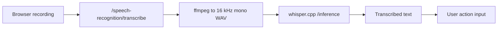

# TTS and STT

Voice support is split into text-to-speech for generated turn presentation blocks and speech-to-text for user input. Both are optional runtime services configured through the same connection/config system as other providers.

## Text-to-speech

TTS is currently implemented through AllTalk V2. The shared backend configuration stores engine and generation parameters, while voices live elsewhere:

- `AllTalk*ModelConfig` stores backend-level settings such as engine, language, speed, temperature, text filtering, and server-side playback options.
- `TtsGenerationConfig` stores per-simulation generation mode and narrator voice.
- `CharacterTtsConfig` stores each character's voice and optional RVC settings.

This allows many characters to share one backend while each character and each simulation narrator can use a different voice.

## TTS modes

`TtsGenerationConfig.mode` controls when voice files are created:

| Mode | Behavior |
| --- | --- |
| `manual` | No automatic voice generation. The frontend or API can request voice for one presentation block. |
| `auto` | Every narration and speech presentation block of a committed turn is voiced automatically. |

Manual voice generation calls `/turn-presentations/blocks/{block_id}/voice`. It is idempotent: if a block already has voice media, the existing media is returned.

Automatic generation is handled by `TurnVoiceTrigger.maybe_generate_for_turn`. It finds all `narration` and `speech` blocks without voice media, resolves the correct voice for each block, generates audio, links it back to the presentation block, and prunes old generated voice media according to `WSE_TTS_MEDIA_RETENTION_TURNS`.

Generation uses a process-wide semaphore controlled by `WSE_TTS_MAX_CONCURRENCY`, so one busy simulation cannot open unlimited concurrent TTS calls.

## Segment voices

Voice selection follows the presentation structure:

- `speech` blocks with a `speaker_id` use that character's `CharacterTtsConfig` when present.
- `narration` blocks and unattributed speech use the simulation narrator voice from `TtsGenerationConfig`.
- RVC voice and pitch are resolved from the character or narrator config.

The backend disables AllTalk's own narrator splitting for turn-block TTS calls. The application has already split the turn into single-voice segments, so backend quote parsing would risk assigning the wrong voice.

## Speech-to-text

STT is currently global rather than per simulation. The `/speech-recognition/transcribe` endpoint reads the one configured global STT model and connection, then sends uploaded audio to the backend.

The implemented provider is whisper.cpp's HTTP server:

- `WhisperCppSttModelConfig` stores language, translation, temperature, fallback temperature increment, initial prompt, and carry-initial-prompt options.
- `SttWhisperCpp` calls whisper.cpp's `/inference` endpoint.
- Browser recordings are converted to 16 kHz mono 16-bit PCM WAV with `ffmpeg` before upload to whisper.cpp, because a stock whisper.cpp server expects WAV unless it was started with conversion support.

The frontend recorder sends audio to STT and inserts the returned text into the user input flow. A per-call language override can be supplied without changing the global model config.

