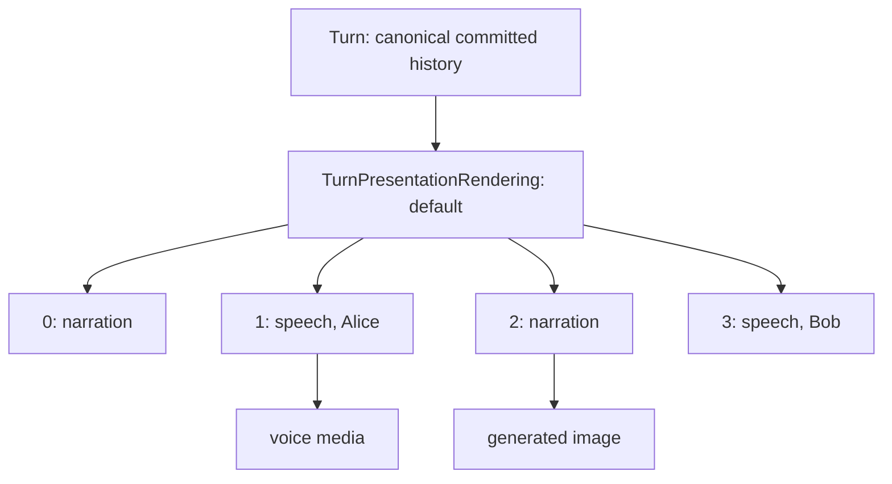

# Turn Presentation

A canonical turn is one committed unit of simulation history. The frontend does not have to render that turn as one bubble. World Simulation Engine stores a separate, non-authoritative presentation layer that can split one turn into ordered display blocks.

The key models are:

| Model | Purpose |
| --- | --- |
| `Turn` | Canonical record: sequence, type, content, and start time. |
| `TurnPresentationBlock` | One ordered display segment for a turn. |
| `TurnPresentationRendering` | A locale/rendering-specific ordered set of blocks for one turn. |
| `PresentedTurn` | API projection that returns the canonical turn plus the selected presentation blocks. |

Presentation blocks never carry simulation authority. They are for rendering, voice, images, streaming state, and alternate display variants.

## Block types

`PresentationBlockType` supports:

| Type | Frontend treatment |
| --- | --- |
| `action` | User action bubble, including formatted user text. |
| `speech` | Character speech bubble with speaker attribution and avatar. |
| `narration` | Narration card/bubble. |
| `thought` | Styled internal thought block. |
| `system_notice` | System notice block. |
| `media` | Media placeholder/block. |

The model enforces that non-media blocks have text, media blocks have `media_id`, speech blocks have speaker attribution, and block sequence numbers are contiguous.

## Why one turn becomes multiple bubbles

The narrator returns structured narration blocks. During commit, `WorldSimulator._store_default_presentation` stores each narration or speech block as a `TurnPresentationBlock`. A single turn might therefore render as:

- narration introducing the result,
- one speech bubble for Alice,
- one narration block for an action,
- one speech bubble for Bob,
- a generated scene image linked to one specific block.

This is deliberately different from storing the canonical state as formatted chat text. The turn remains one simulation event for sequencing, audit, regeneration, and time advancement, while the UI can render a natural conversation.

## API and fallback behavior

The turn API exposes:

- `/turn-presentations` to list turns with presentation blocks,
- `/turns/{turn_id}/presentation` to fetch one presented turn,
- `/turns/{turn_id}/presentation/{rendering_id}` to replace a rendering,
- image and voice endpoints that attach generated media to either a turn or a presentation block.

If a turn has no stored presentation blocks, the backend creates a legacy presentation projection:

- user turns become one `action` block,
- JSON `NarrationProposal` content becomes its narration/speech blocks,
- plain text system output becomes one `narration` block.

This keeps old turns renderable while new turns use explicit presentation data.

## Frontend rendering

`SimulationChatPage` prefers `narration_blocks` when present. It maps blocks to specialized components:

- `SpeechBlockMessage` renders character speech with speaker avatar, segment voice controls, and portrait image generation.
- `UserActionBlockMessage` renders user action text and can request a scene image for that block.
- `NarrationCardBlockMessage` renders narration, thought, system notice, action, or media blocks and can request scene images for narration.

Images are loaded per block when block presentation exists, or per whole turn for legacy single-bubble turns. Voice controls operate per narration/speech block, which is why TTS can voice a turn as multiple natural audio segments instead of one long monologue.
