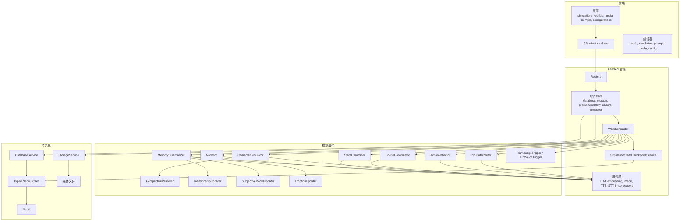

# 组件地图

本页把主要运行时组件映射到各自职责，适合作为阅读后端或持久化页面之前的快速导览。

## 运行时组件地图

## 模拟组件

| 组件 | 读取 | 产出 | 事实边界 |
| --- | --- | --- | --- |
| `InputInterpreter` | 用户文本和当前模拟上下文 | 结构化候选用户动作或 OOC 检测 | 只是提案。 |
| `OOCHandler` | out-of-character 指令、已感知场景状态、现有 trigger | 已评估的 OOC 条目：世界状态变更、针对某个 NPC 的动作指导，或 trigger 的 create/update/status/delete 指令 | 只是提案；仍会经过正常的 state commit 和 trigger 路径校验/应用。 |
| `ActionValidator` | 拟议动作和图状态 | 校验结果和返工反馈 | 只是提案。 |
| `CharacterSimulator` | 私有 `CharacterPerspective` | 角色动作或反应提案 | 只是提案。 |
| `PerspectiveResolver` | 图中的感知候选 | actor 作用域内可感知实体 | 私有上下文。 |
| `SceneCoordinator` | 有效动作计划和反应历史 | 已接受动作时间线或协调问题 | 只是提案。 |
| `StateCommitter` | 已接受动作 | `StateCommitProposal` 操作 | 只有 store 应用后才成为事实。 |
| `MemorySummarizer` | 已提交回合、观察者、state commit | 事件、记忆、intent 更新 | memory store 应用后的派生事实。 |
| `RelationshipUpdater` | 记忆和视角证据 | 关系提案 | store 应用后的派生事实。 |
| `SubjectiveModelUpdater` | 记忆和观察者上下文 | 私有主观断言提案 | store 应用后的私有派生事实。 |
| `EmotionUpdater` | 记忆、动作、角色状态 | 私有情绪向量更新 | store 应用后的私有派生事实。 |
| `Narrator` | 已接受或已提交回合上下文 | `NarrationProposal` / 呈现文本 | 显示层，不是物理事实。 |
| `ActionSuggester` | 最近回合上下文 | 建议用户动作 | 仅 UI 辅助。 |
| `SemanticTriggerEvaluator` | 一批休眠 trigger 的 `SemanticCondition` 语句，加上最近的叙事/记忆 | 关于某个条件当前是否成立的 fact 或 pacing 判断 | 只是提案；trigger 只有在条件（语义或确定性）被确认后才会触发。 |

## 服务组件

| 服务 | 职责 |
| --- | --- |
| `LlmService` | 组合 prompt messages、调用 chat providers，并修复结构化输出。 |
| `EmbedService` | 调用 embedding providers，用于记忆和 intent 检索。 |
| `ImageService` | 向 ComfyUI-compatible 图像后端提交图像 prompt。 |
| `TurnImageTrigger` | 判断并执行回合或实体图像生成副作用。 |
| `TurnVoiceTrigger` | 为 turn presentation 片段执行已配置的 TTS 生成副作用。 |
| `StorageService` | 存储和读取内容寻址媒体与 JSON artifact。 |
| `AuditService` | 为生成、校验、协调、提交、时间和错误记录结构化审计事件。 |
| `SimulationStateCheckpointService` | 捕获和恢复完整的已持久化实体图，支撑 turn 的重新生成、回退，以及将来的 OOC 变更撤销。 |

## 配置流

供应商连接、模型配置、prompt 分配、workflow 分配和按组件绑定都存储在 Neo4j 中。模拟组件在运行时加载自己的配置。这意味着同一套代码路径可以为输入解释、角色提案、协调、叙事、图像 prompt 构建和媒体生成使用不同模型。

