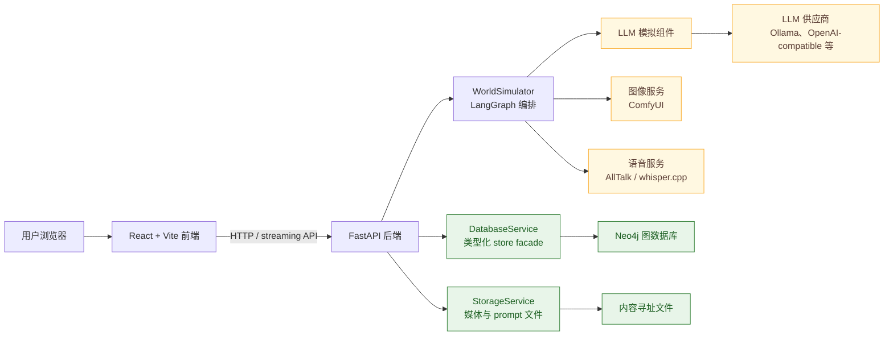

# 架构

World Simulation Engine 是一个本地优先的模拟应用，由 React 前端、FastAPI 后端、Neo4j 图数据库，以及由 LangGraph 编排的模拟流水线组成。核心设计选择是：自然语言不是事实来源。LLM 组件负责提出结构化动作、状态变更、记忆和叙事，而代码负责路由、校验、图持久化、时间推进和审计记录。

本节把 README 中简短的架构摘要展开成几个主要视角：

| 页面 | 内容 |
| --- | --- |
| [模拟生命周期](simulation-lifecycle.md) | 一个用户回合如何从文本进入动作提案、图状态提交、记忆更新、叙事和呈现。 |
| [组件地图](component-map.md) | 主要运行时组件，以及每一层负责什么。 |
| [后端](backend.md) | FastAPI 启动、路由、服务、供应商适配器和生成流。 |
| [前端](frontend.md) | React/Vite 页面结构，以及 UI 如何映射到后端资源。 |
| [持久化](persistence.md) | Neo4j store、媒体存储、已提交事实、快照、审计记录和派生认知状态。 |
| [后台模拟](background-simulation.md) | 前台用户回合如何与离场角色活动共存。 |

## 系统容器

前端不会直接访问 Neo4j 或供应商 API。它调用后端，由后端为每次操作解析已配置的供应商、模型档案、prompt、workflow 和图状态。

## 边界

| 边界 | 归属 | 说明 |
| --- | --- | --- |
| 浏览器状态与交互 | 前端 | 路由、编辑器、聊天视图、媒体控件、配置表单。 |
| API 契约 | FastAPI routers | 世界、模拟、实体、配置、媒体、prompt、回合和生成运行的资源端点。 |
| 模拟编排 | `WorldSimulator` | 构建并运行 LangGraph，管理运行锁、快照、离场队列和副作用触发器。 |
| LLM 行为 | 组件 prompt 和模型配置 | 组件产出结构化结果，通常会在使用前修复并校验。 |
| 已提交事实 | Neo4j stores | 物理状态、回合、记忆、关系、主观断言、情绪、配置、审计和快照。 |
| 二进制或 JSON 媒体 | `StorageService` 加媒体图节点 | 图像、语音文件、prompt media 和 workflow media 存储在 Neo4j 外部，并通过图记录关联。 |

## 核心原则

模拟器区分三类数据：

- **私有上下文**：有角色作用域的视角、记忆、关系、主观断言和情绪，用来生成提案。
- **拟议状态**：LLM 输出的结构化结果，可以被校验、协调、修复、拒绝或重做。
- **已提交事实**：通过数据库服务写入的图变更和回合记录。

最重要的架构规则是：LLM 输出不会仅仅因为被生成就成为事实。只有在校验器、场景协调器、状态提交器和数据库提交路径接受之后，它才会成为事实。

