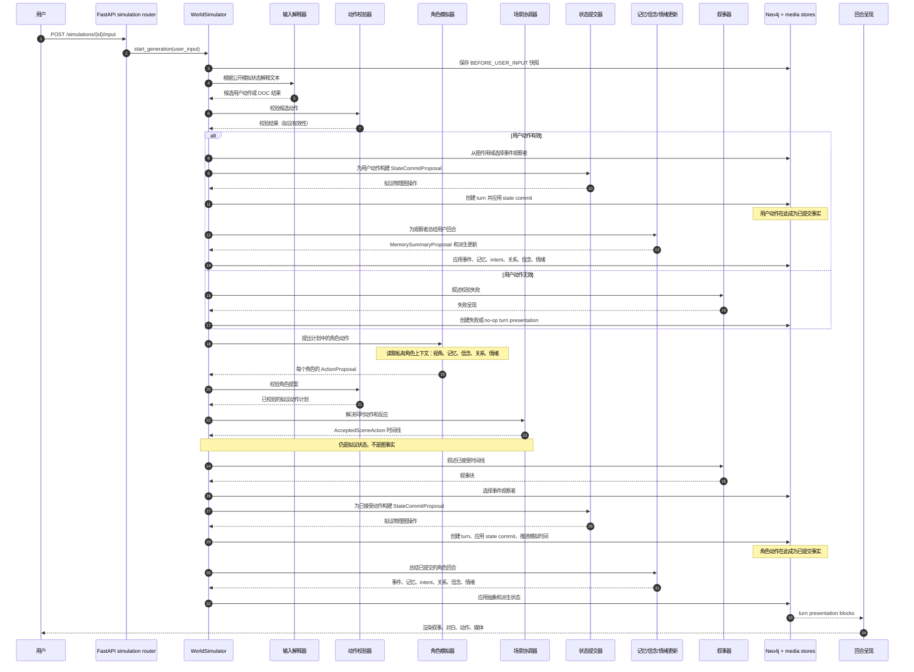

# 模拟生命周期

Simulation API 会把一次模拟生成作为后台任务启动。普通用户回合会在 `WorldSimulator` 中运行 user-input LangGraph；继续生成和重新生成则会从保存的图状态快照恢复 character-round graph。

## 单回合序列

下图展示普通回合的数据边界。实际 graph 可能因为无效输入、出戏命令、trigger 评估、反应轮或没有计划中的角色活动而分支，但事实边界相同：候选数据和拟议数据在 state commit 应用已接受操作之前都只是临时状态。

## 状态阶段

| 阶段 | 示例 | 事实状态 |
| --- | --- | --- |
| 解释 | `InputInterpretation`、候选 `ProposedAction` | 不是事实，只是解析出的提案。 |
| 校验 | `ActionValidationResult` | 不是事实，只决定提案能否继续。 |
| 角色提案 | `ActionProposal`、`CharacterActionPlan` | 不是事实，是单个 actor 基于私有上下文的输出。 |
| 协调 | `SceneCoordinationResult`、`AcceptedSceneAction` | 不是事实，是准备提交的已接受时间线。 |
| 物理提交提案 | `StateCommitProposal` | 在数据库 store 应用之前不是事实。 |
| 物理提交 | `Turn`、图实体/关系变更、`Simulation.current_time` | 已提交事实。 |
| 抽象记忆提交 | `MemorySummaryProposal`、事件、记忆、intent | memory summary store 应用后的已提交派生事实。 |
| 呈现 | `TurnPresentationRendering` | 从已提交回合和叙事派生的显示层。 |

## 私有上下文

角色提案、反应提案、关系更新、主观模型更新和情绪更新会读取私有角色上下文。它不应被视为全局可见状态。角色 prompt 接收的是有作用域的 `CharacterPerspective`，不是完整图。这个视角可以包含私有记忆、主观断言、私有关系描述和情绪，但只对正在构建上下文的 actor 可见。

## 快照与重新生成

`WorldSimulator` 会在用户输入前、以及每个生成基准点之后保存图状态快照。继续生成和重新生成直接加载这些快照，不需要从叙事文本反推执行状态——重新运行依据的是结构化图状态和模拟器自身的中间状态。

