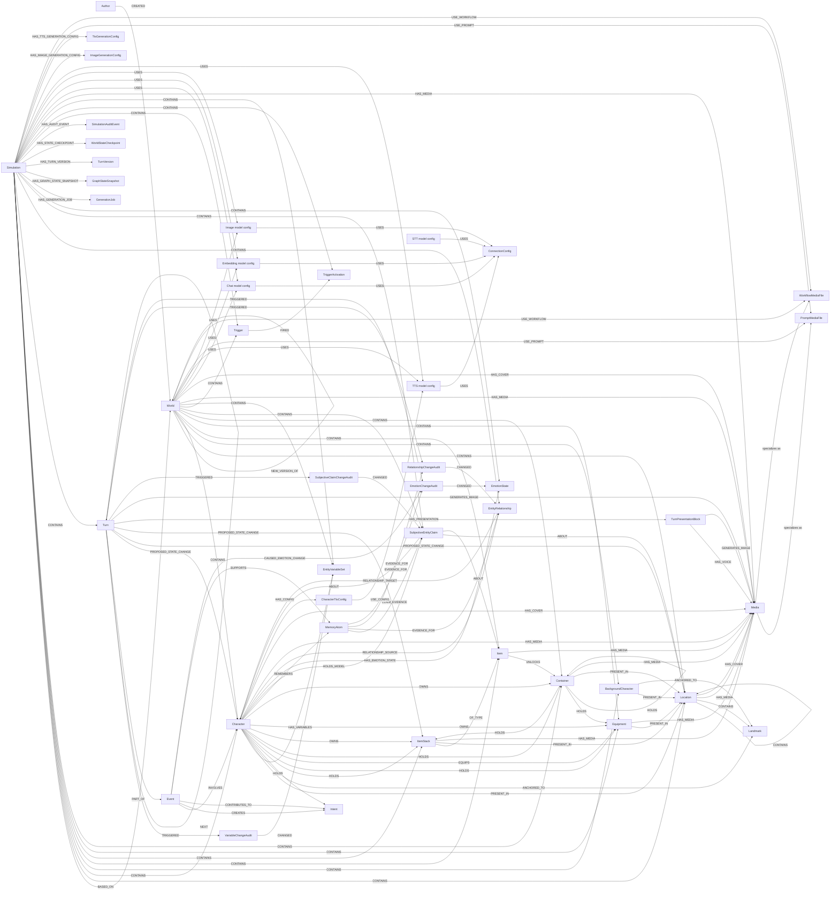

# 数据模型

World Simulation Engine 把叙事状态存储为结构化图数据。这个图不只是持久化层，也是工作记忆：模拟组件依靠它回答谁在场、角色私下相信什么、哪些记忆支持某段关系、哪些生成媒体属于某个回合等问题。

本节是贡献者参考，覆盖主要节点标签、关系、生命周期规则和 API 表面。

## 模型家族

| 领域 | 文档 | 主要标签 |
| --- | --- | --- |
| 世界结构 | [世界与地点](world-and-location.md) | `Author`, `World`, `Simulation`, `Location`, `Landmark` |
| 人物 | [角色](characters.md) | `Character`, `BackgroundCharacter`, `Intent`, `CharacterTtsConfig` |
| 物理状态 | [物品与容器](items-and-containers.md) | `Item`, `ItemStack`, `Equipment`, `Container` |
| 回合历史 | [事件、回合与动作](events-turns-and-actions.md) | `Turn`, `TurnPresentationBlock`, `Event`, `Intent`, `Trigger`, `TriggerActivation`, `GenerationJob`, `GraphStateSnapshot`, `TurnVersion`, `WorldStateCheckpoint`, `SimulationAuditEvent` |
| 记忆与信念 | [记忆与主观断言](memories-and-claims.md) | `MemoryAtom`, `SubjectiveEntityClaim`, `SubjectiveClaimChangeAudit` |
| 社交状态 | [关系与情绪](relationships-and-emotions.md) | `EntityRelationship`, `EmotionState`, `RelationshipChangeAudit`, `EmotionChangeAudit` |
| 追踪变量 | 跨领域机制；`Character` 的情况见[角色](characters.md) | `EntityVariableSet`, `VariableChangeAudit` |
| 资产与服务配置 | [媒体与配置](media-and-configuration.md) | `Media`, `ConnectionConfig`, 模型配置节点、生成配置节点 |

## 完整实体关系图

## 跨领域规则

- `World` 是可复用的作者模板。`Simulation` 是基于某个 world 的可变运行状态。
- 大多数作者态和运行时实体通过 `CONTAINS` 连接到 `World` 或 `Simulation`。
- Simulation 可以通过 `BASED_ON` 读取继承的 world 数据，但运行时变更会提交到 simulation 图中。
- 正常状态下物理位置是互斥的：对象要么在地点中，要么被其他实体持有/装备，要么在容器中。
- Turn 使用 `PROPOSED_STATE_CHANGE` 记录提案；只有 state committer 写入拟议变更后，图才成为已提交事实。
- 私有上下文体现在角色字段、主观断言、关系 visibility、记忆和情绪状态中。呈现 API 应只暴露合适的渲染视图。
- 追踪变量是通用机制：任何实体（不只是 `Character`）都可以通过 `HAS_VARIABLES` 拥有一个 `EntityVariableSet`，其中保存自己的有类型/有边界的 `VariableDefinition`（对应 SillyTavern MVU variable schema）。变更审计方式与关系、情绪相同，通过 `VariableChangeAudit` 记录。
- `TurnVersion` 和 `WorldStateCheckpoint` 不是永久历史记录：它们的作用是让 turn 的重新生成和回退更安全，一旦故事真正
  向前推进就会被清理（见[事件、回合与动作](events-turns-and-actions.md#turn-版本与状态检查点)）。

