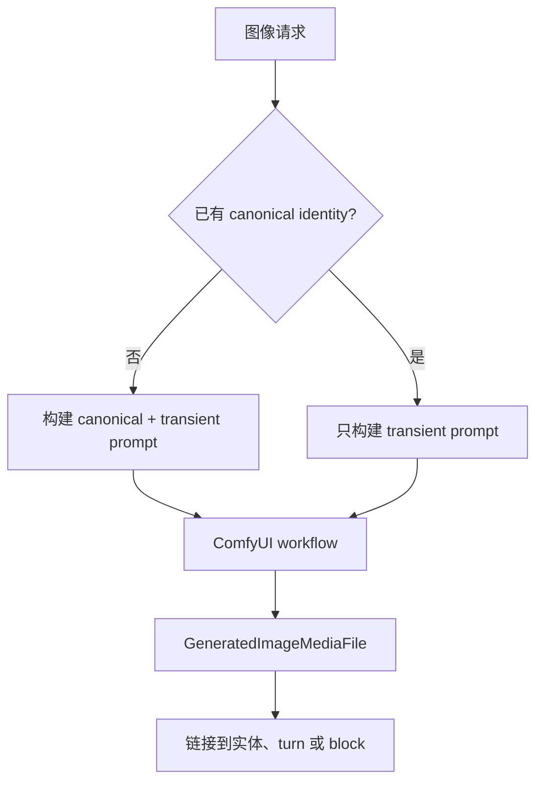

# 图像生成

世界模拟引擎把图像视为链接回图的生成媒体。图像不只是文件夹中的文件：生成图像记录会保存 component、workflow name、canonical identity tags、transient tags、negative prompt，并链接到实体、turn 或 presentation block。

实现分为按目标区分的图像生成组件，以及 turn 级触发器。

## 生成目标

| 目标 | 组件 | 描绘内容 |
| --- | --- | --- |
| 角色状态图 | `CharacterImageGenerator` | 单个角色在中性背景上的 standalone reference/state portrait。 |
| 角色环境肖像 | `CharacterPortraitImageGenerator` | 位于当前地点中的一个角色，可由某个 turn 或 presentation block 提供上下文。 |
| 地点状态图 | `LocationImageGenerator` | 单个地点的宽幅 establishing image，不包含角色。 |
| 物品状态图 | `ItemImageGenerator` | 单个物品的 product-style standalone 图像。 |
| 场景图 | `SceneImageGenerator` | 某个地点中当前在场的角色，可由 turn 叙事提供上下文。 |

状态图可以使用 world 或 simulation 作为 `source_id`，因为它们只需要模型、提示词和 workflow 配置。角色环境肖像和场景图是 simulation-scoped，因为它们依赖实时角色位置和当前场景状态。

## 手动生成

手动生成是显式的，由用户触发。API 提供以下端点：

- 角色、地点和物品状态图；
- simulation 中的角色环境肖像；
- simulation 地点的场景图。

基于 turn 的请求可以包含 `turn_id` 和可选 `block_id`。如果提供，生成媒体会链接到整个 turn 或某个具体 presentation block，让前端可以把图像显示在请求它的叙事、动作或发言片段旁边。

## 自动生成

自动 turn 图像由 `ImageGenerationConfig` 控制：

| 模式 | 行为 |
| --- | --- |
| `manual` | 不自动生成。图像只由显式请求生成。 |
| `auto` | 检查 turn 是否具有视觉重要性。重要 turn 会生成场景图。 |
| `always` | 每个已提交 turn 都尝试生成场景图。 |

在 `auto` 模式中，`TurnImageTrigger` 先应用确定性的 action-type 检查。移动、攻击、物品操作、姿势变化以及类似物理变化会被视为重要。等待、纯发言、观察和查看通常不重要。如果动作类型无法决定，则由 `turn_image_trigger` LLM 组件判断。

`fallback_turns` 防止长时间没有新图像。如果距离上一次生成 turn 图像已经经过足够多 turn，`auto` 模式会强制生成场景图，即使重要性检查结果为否。

## Canonical 和 transient 图像提示词

图像流水线会把永久身份和临时状态分开：

- Canonical identity 捕获稳定视觉特征：角色外观、固定物体特征或持久地点特征。
- Transient prompt content 捕获当前姿势、表情、服装、光照、关系、动作或场景瞬间。

第一次生成的 cover image 会建立 canonical identity。之后的生成会复用它，并只要求 LLM 生成 transient prompt content。组合图像，例如角色环境肖像和场景图，会先确保每个参与者都有 canonical identity，然后把这些身份和新的 turn-grounded transient details 组合起来。

## 配置

每个图像目标都会使用：

- 用于 prompt 构建或 turn 重要性判断的 chat model config；
- 用于执行 ComfyUI workflow 的 image model config。

组件分配很重要。一个 simulation 可以用一个 LLM 进行普通叙事，用另一个小模型进行 `turn_image_trigger` 判断，并为 `scene_image_generator` 使用独立图像配置。

自动生成是 fire-and-forget。失败会记录日志并被吞掉，因此图像后端问题不会破坏核心 turn 流水线。
