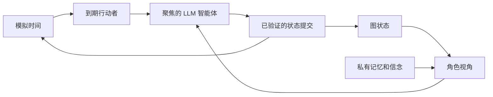

# 功能

世界模拟引擎围绕四个相互关联的设计选择构建：

- 时间在模拟世界内部推进，而不只是按聊天消息数量推进。
- 世界状态存储为带类型的图数据，而不是一份 transcript 或一组彼此割裂的表。
- 模拟被拆分为多个聚焦的 LLM 智能体，每个智能体只负责一个狭窄任务，并拥有自己的模型配置。
- 角色从受限视角行动，拥有私有记忆和信念，而不是全员共享全知的 canonical state。

这些功能是一起实现的。调度器会询问在当前模拟时间谁应该行动。每个行动者都会收到一个由图状态、感知解析、关系、记忆召回、意图和私有情绪约束构建的视角。被选中的智能体只提出、验证、协调、叙述和提交结构化变化。随后，图会成为下一步的事实来源。

阅读以下章节了解细节：

- [基于时间的模拟](time-based-simulation.md)
- [结构化图数据](structured-graph-data.md)
- [多智能体流程](multi-agent-flow.md)
- [视角与记忆](perspective-and-memory.md)
- [图像生成](image-generation.md)
- [TTS 与 STT](tts-and-stt.md)
- [Turn 呈现](turn-presentation.md)
- [Turn 版本与状态检查点](turn-versioning.md)
