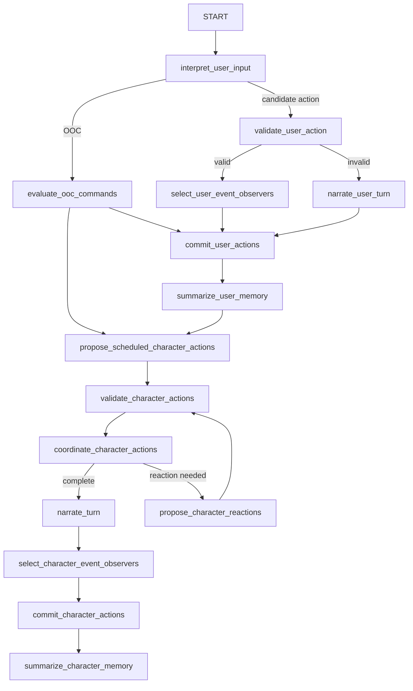

# 多智能体流程

世界模拟引擎不会使用一个万能 prompt 来决定所有事情。它使用一组聚焦的 LLM-backed 组件，每个组件负责模拟中的一个阶段。编排逻辑位于 `WorldSimulator`，它会为用户输入生成和角色轮次生成构建 LangGraph state graph。

每个组件都会继承共享的 `SimulatorComponent` 行为：

- 声明一个 `ComponentType`。
- 加载当前 simulation 中分配给该组件的 chat model。
- 加载分配给该组件和 world language 的 prompt。
- 接收结构化上下文。
- 返回结构化输出，通常通过 `LlmService.invoke_structured_with_repair`。

这允许不同流水线阶段使用不同提供商、模型、提示词和生成参数。

## 智能体与职责

| 组件 | 用途 | 何时激活 |
| --- | --- | --- |
| `InputInterpreter` | 将用户文本转换为结构化候选动作，或检测输入是否为 OOC。 | 用户输入生成开始时。 |
| `OOCHandler` | 评估 OOC 命令，并可以生成世界状态 mutation 或 forced actions。 | 输入解释标记为 OOC 之后。 |
| `ActionValidator` | 检查用户或角色提议的动作在当前状态中是否有效。 | 用户动作解释或角色动作提议之后。 |
| `CharacterSimulator` | 构建角色视角，并为一个行动者提出动作或反应。 | 已排程角色轮次、反应轮次、离场活动和动作建议。 |
| `SceneCoordinator` | 将同时发生或冲突的有效行动计划解析为 accepted actions、pending actions 或 problems。 | 已有验证通过的动作提议之后。 |
| `Narrator` | 将已接受、已提交的事件转换为面向用户的叙事或失败文本。 | 协调之后，或验证失败之后。 |
| `StateCommitter` | 将已接受动作转换为物理图 mutation。 | 协调接受动作之后。 |
| `MemorySummarizer` | 将已提交 turn 转换为事件、记忆和意图变化。 | 物理提交之后。 |
| `PerspectiveResolver` | 从图和 resolver prompts 构建一个角色可以感知到的内容。 | 角色动作/反应提议内部。 |
| `RelationshipUpdater` | 根据新记忆和视角证据更新一等关系记录。 | turn 后记忆/关系处理期间。 |
| `SubjectiveModelUpdater` | 更新角色持有的私有实体声明。 | turn 后记忆/关系处理期间。 |
| `EmotionUpdater` | 更新作为软约束使用的私有情绪状态。 | 启用情绪时的 turn 后角色状态处理期间。 |
| `ActionSuggester` | 生成建议用户动作，但不改变已提交状态。 | 用户或角色 turn 准备呈现后并行运行。 |

图像和语音生成器遵循相同整体模式，但它们作为媒体副作用运行，而不是核心状态模拟。

## 用户输入图

用户输入从解释开始，然后根据结果路由：

当没有有效用户动作或没有已排程角色动作时，这个图也可以提前结束。

## 角色轮次图

角色轮次用于继续、重新生成和已排程非用户活动。它们直接从 `propose_scheduled_character_actions` 开始，然后经过验证、协调、叙事、提交和记忆摘要。

这就是为什么模拟器可以在用户 turn 之后继续，而不需要另一条用户消息。活跃的模拟时间和角色活动会决定是否有人应该行动。

## 并发和 fan-out

当需要多个独立行动者或 resolver 调用时，实现会使用 LangGraph `Send` fan-out 模式：

- 角色动作提议可以按行动者独立运行。
- 视角解析可以在感知角色、背景角色、物品、装备、容器和 landmarks 之间 fan out。
- 一个小型可复用 fan-out 子图会在并发执行后恢复确定性的输出顺序。

并发由调度器限制和图结构共同约束。最终提交结果仍然必须经过验证、协调和单一状态提交路径。

## 路由和修复

智能体生成结构化模型，而不是任意 prose。若干模型包含 validator，用来修复常见的本地模型错误，例如缺失 discriminator 字段。`LlmService.invoke_structured_with_repair` 会给组件第二次机会返回有效的结构化输出。

路由是显式的：

- 验证可以路由到失败叙事、rework 或协调。
- 协调可以路由到完成、反应、用户决策或停止。
- 如果有已排程角色到期，记忆摘要可以路由到另一个角色轮次。
- 基于 snapshot 的继续和重新生成会在运行角色轮次前恢复图状态。

结果是一个 LLM 做有界决策，而代码负责编排、持久化、计时和不变量的流水线。
