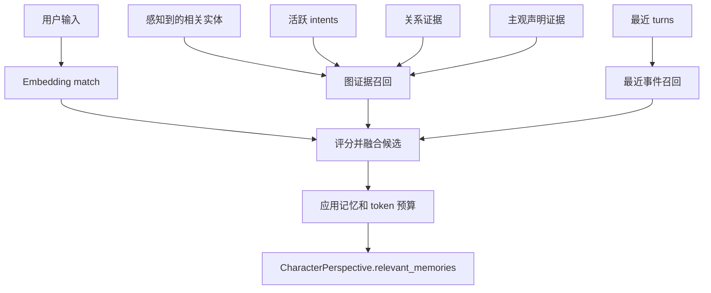

# 视角、记忆与召回

世界模拟引擎中的角色不会收到一整块全局 canonical information。它们会在当前模拟时间获得一个为该行动者构建的受限视角。这个视角结合了行动者可以感知到什么、记得什么、当前打算做什么、哪些关系对它可用，以及它持有什么私有信念。

这由 `CharacterSimulator._build_perspective` 实现。

## 一个视角包含什么

`CharacterPerspective` 包含：

| 字段 | 含义 |
| --- | --- |
| `actor` | 正在构建视角的角色。 |
| `world_time` | 当前模拟时钟。 |
| `location` | 行动者当前所在地。 |
| `inventory` / `equipment` | 行动者直接可用的物品和装备。 |
| `intents` | 行动者拥有的活跃目标或语义召回目标。 |
| `perceived_*` | 行动者当前能感知的实体，按类型解析。 |
| `relevant_memories` | 为该行动者召回的一组有界记忆。 |
| `relationships` | 从该行动者视角可用的 objective/public/private 关系。 |
| `subjective_claims` | 该行动者对附近或相关实体持有的私有信念。 |
| `emotion` | 可选私有情绪向量，作为软约束使用。 |

动作提议 prompt 接收的是这个上下文，而不是整个数据库。

## 先感知，再召回

`PerspectiveResolver` 首先从行动者的局部作用域收集图候选：

- 通过包含地点遍历可见的角色，
- 当前地点中的背景角色，
- 当前地点中的 item stacks，
- 当前地点中的装备，
- 当前地点中的容器，
- 当前地点中的 landmarks。

随后它会 fan out 到按类型区分的 resolver prompts。这些 prompt 为每个被感知实体返回 `visibility`、`distance_hint`、`affordances`、`salience` 和 notes。可见角色身上的可见装备会在角色感知解析后附加。

这给模拟器提供了两层过滤：

1. 图遍历决定什么有可能被感知。
2. resolver 决定行动者实际注意到什么，以及它如何显现。

## 记忆模型

`MemoryAtom` 是一个小型可召回单元，包含 summary、keywords 和可选 embedding。它不是全局拥有的。它会连接到：

- 通过 `SUPPORTS` 连接到一个 `Event`，其中包含支持类型；
- 通过 `REMEMBERS` 连接到一个或多个 `Character` 节点；
- `REMEMBERS` 关系上的逐角色记忆元数据：confidence、salience、behavioral relevance 和 stance。

这意味着两个角色可以以不同方式记住同一事件，或者一个角色记得而另一个不记得。记忆本身可以作为证据共享，但访问权是按角色限制的。

## 召回通道

`MemoryRetriever` 会在应用 prompt budget 前组合多个召回通道：

| 通道 | 捕获内容 |
| --- | --- |
| `recent_event` | 最近 turn 中的记忆。 |
| `entity_neighborhood` | 与当前相关实体相连的记忆。 |
| `active_intent` | 与 active 或 paused intents 绑定的记忆。 |
| `relationship_evidence` | 支持涉及相关实体的关系的记忆。 |
| `portrait_evidence` | 支持关于相关实体的私有主观声明的记忆。 |
| `embedding_match` | 当有用户输入可以 embedding 时，语义相似的记忆。 |

候选会获得 channel scores、decayed confidence、temporal proximity 和 salience boost。它们按通道优先级和 fusion score 排序，然后被选择，直到达到最大记忆数或 token budget。默认召回预算有意设置得较小，所以角色得到的是聚焦的记忆集合，而不是 transcript dump。

## 意图和情绪

Intents 也通过 `HOLDS` 按角色限定作用域。模拟器会根据 deadline、priority、urgency，以及与用户输入的语义匹配来召回 intents。启用情绪时，私有情绪可以略微影响 need 和 reaction 类型的意图，提高 priority 或 urgency，但不会修改 canonical intent。

情绪作为 tone、risk tolerance、interruption behavior 和 urgency 的软约束。prompts 会明确要求组件不要暴露私有数字情绪值。

## 私有信念和关系

系统把关系记录和主观声明分开：

- `EntityRelationship` 是两个实体之间的一等关系节点。它可以是 objective、public，或对某个视角 private，并保留 evidence memory ids 和版本历史。
- `SubjectiveEntityClaim` 是一个观察者对另一个实体持有的私有模型。它包含 category、statement、stance、confidence、supporting evidence、contradicting evidence、version 和 active flag。

主观声明查询有意要求提供 observer。角色动作 prompt 没有全知的“列出所有人知道什么”召回路径。

## 为什么这比给所有人 canonical info 更好

如果每个角色 prompt 都收到全部 canonical state，那么每个角色都会隐式知道秘密、远处事件、隐藏动机，以及它们本应只能推断出的事实。prompt 可以写“不要使用这些信息”，但信息已经进入上下文。

受限视角方法有不同性质：

- 隐藏信息不会进入行动者 prompt，除非感知、记忆或信念证明它应该进入。
- 误解和错误信念可以作为一等状态持续存在。
- 记忆会衰减，并竞争有限 prompt budget。
- 证据链接解释角色为什么相信或召回某事。
- 两个角色可以对同一事件或人物形成不同模型。
- 叙事可以从已提交状态生成，而不强迫每个行动者共享同样知识。

这比全局上下文 dump 更昂贵，但也是模拟能够支持私有知识、局部感知和角色特定连续性的主要原因。
