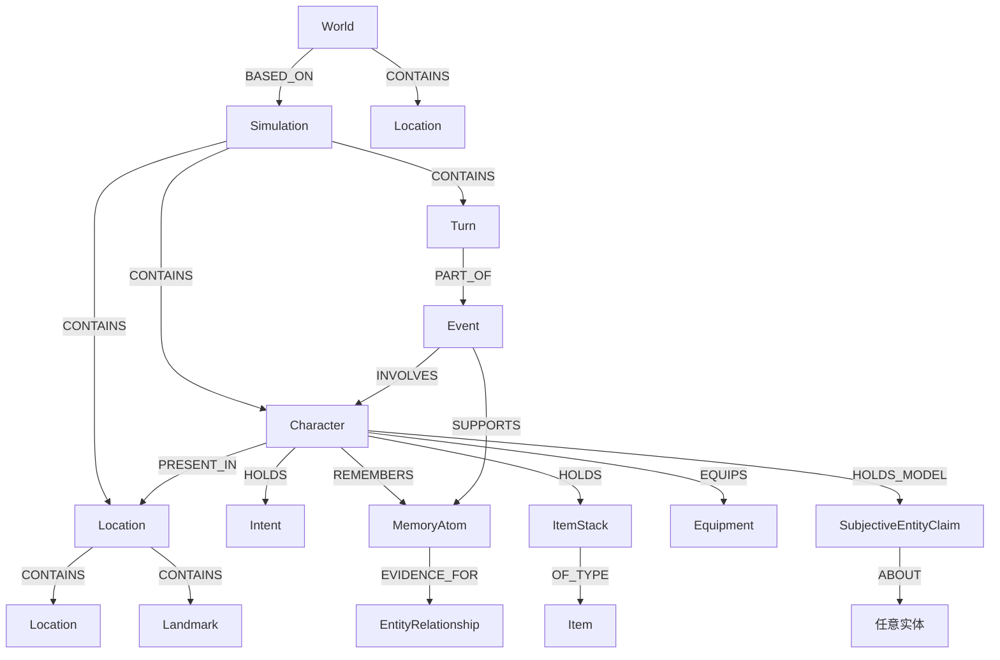

# 结构化图数据

世界模拟引擎把模拟世界作为带类型的图数据存储在 Neo4j 中。文本叙事只是输出层，而不是事实来源。角色、地点、物品、事件、记忆、意图、关系、turn、媒体和配置都表示为可以直接查询的节点和关系。

## 核心形状

准确的数据库 schema 由 `service/database` 下的 store 类实现，并由 `model` 下的 Pydantic 模型描述。这个图有意按照领域建模，而不是按照表建模。



有些关系表示物理状态，例如 `PRESENT_IN`、`HOLDS`、`OWNS`、`EQUIPS`、`CONTAINS`、`PART_OF` 和 `OF_TYPE`。另一些关系表示来源或认知，例如 `SUPPORTS`、`REMEMBERS`、`EVIDENCE_FOR`、`CLAIM_EVIDENCE`、`HOLDS_MODEL`、`CREATES` 和 `CONTRIBUTES_TO`。

## 为什么用图

角色扮演世界本质上关系很多：

- 一个地点可以包含嵌套地点、landmarks、角色、容器、item stacks 和装备。
- 一个角色可以同时拥有、持有、穿戴、记得、相信、打算、感知并关联许多实体。
- 一段记忆属于一个事件，但不同角色可以以不同 confidence、salience、stance 和 behavioural relevance 记住同一段记忆。
- 一个关系可以是 objective、public，或对某个角色 private，并且可以携带证据记忆。
- 一个 turn 可以链接到一个事件，事件可以支持记忆，而这些记忆之后又可以更新信念或关系。

在普通关系型设计中，这些结构会变成许多 join table 和反复的多跳 join。对于固定业务记录这可行，但对模拟来说会变脆，因为每个查询都在问：“在这个世界中，从这个视角出发，经过这些证据路径，什么东西与这个行动者相连？”

Neo4j 让实现可以直接表达这个问题。例如，数据库服务可以用包含地点遍历来询问某个观察者可感知的角色：

```cypher
MATCH (observer:Character {id: $observer_id})-[:PRESENT_IN]->(observer_location:Location)
MATCH (observer_location)-[:CONTAINS*0..]->(location:Location)
MATCH (character:Character)-[present:PRESENT_IN]->(location)
```

这不只是存储细节。它让感知、所有权、地点作用域、记忆证据和 simulation 继承都成为自然的查询形状。

## 物理状态和抽象状态分离

状态提交器通过 `StateCommitProposal` 处理物理图变化。这些操作可以创建实体、修改字段、提升实体，以及改变关系。这个模型有意把事件、记忆和意图排除在物理提交路径之外。

抽象状态由 `MemorySummaryProposal` 处理。它可以创建或更新事件、记忆和意图，并把 turn 链接到事件。这种分离很重要，因为“门打开了”和“Alice 记得 Bob 背叛了她”是不同种类的状态：

- 物理状态变化影响下一步能发生什么。
- 抽象状态变化影响角色会召回什么、相信什么、选择什么。
- 两者都基于已提交 turn，但不会被合并成一段模糊的 prose summary。

## 来源和可审计性

已提交的图变化会链接回 turn。状态提交操作使用 `PROPOSED_STATE_CHANGE` 等 `Turn` 关系，而记忆和关系系统会保留证据链接以及版本/audit 记录。

这让图对调试和重新生成很有用：

- 可以检查哪个 turn 修改了某个实体。
- 可以询问哪个事件支持某段记忆。
- 可以询问哪些记忆支持某个关系或主观声明。
- 可以把一个 world 复制成 simulation，同时重映射 entity ids。
- 可以 snapshot 图生成状态，并为继续或重新生成恢复它。

## 为什么这里比关系型设计更强

优势并不是“图数据库永远更好”。优势在于这个模拟领域主要由带类型实体和不断演化的关系组成。

| 需求 | 关系型形状 | 图形状 |
| --- | --- | --- |
| 嵌套地点和可见性作用域 | 递归 join 或 closure table | `CONTAINS*0..` 遍历 |
| 角色物品栏和装备 | 多个语义不同的 join table | `HOLDS`、`OWNS`、`EQUIPS`、`PRESENT_IN` 边 |
| 事件支持的记忆 | Event 表、Memory 表、join table、character-memory join table | `Turn -> Event -> Memory`、`Character -> Memory` |
| 私有信念 | 在多张表中加入额外 perspective 列 | 观察者拥有的 `SubjectiveEntityClaim` 节点 |
| 证据支持的关系 | Relationship rows 加 evidence joins | 连接端点和记忆证据的一等 `EntityRelationship` 节点 |
| 受限召回 | 带 world/simulation 过滤的许多 join | 从 `World` 或 `Simulation` 出发的路径约束遍历 |

图让世界保持为模拟器实际推理时使用的形状，并且可检查。
