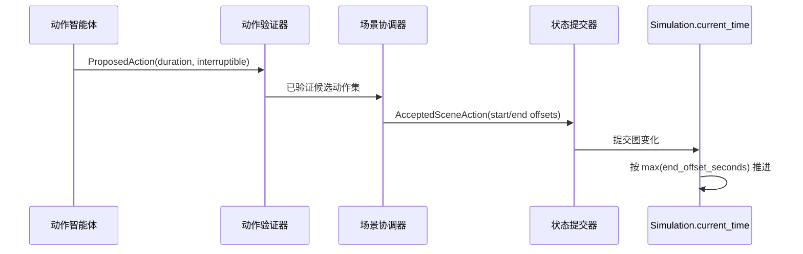

# 基于时间的模拟

大多数聊天系统按消息数量推进：用户发送一条消息，模型回复一次，这个交换就成为下一段历史。世界模拟引擎把时间视为模拟世界的一部分。一个 turn 有 `start_time`，每个 simulation 有 `current_time`，角色动作则带有持续时间和中断元数据。

核心模型包括：

| 模型 | 作用 |
| --- | --- |
| `World.starting_time` | 从世界创建模拟时使用的初始时钟值。 |
| `Simulation.current_time` | 一个运行中模拟的权威当前时间。 |
| `Turn.start_time` | 已提交 turn 开始时的模拟时间。 |
| `ProposedAction.intended_duration_seconds` | 如果不被中断，行动者预期动作会持续多久。 |
| `ProposedAction.interruptible` / `interruption_triggers` | 另一个事件是否可以中断该动作，以及什么会触发中断。 |
| `CurrentActivity.expected_end` | 已在进行中的角色活动下一次应被重新评估的时间。 |

## 时间如何推进

模拟器不会要求 LLM 直接设置下一个时钟值。流程是：

1. 动作智能体提出带有预期持续时间的有序动作。
2. 验证器检查这些动作是否可以从当前状态开始。
3. 场景协调器接受一组动作，并为每个接受的动作分配 `start_offset_seconds` 和 `end_offset_seconds`。
4. 状态提交器应用物理图变化。
5. `WorldSimulator._create_turn_and_apply_commit` 在 `simulation.current_time` 创建 turn。
6. 模拟时钟由 `WorldSimulator._coordination_elapsed_seconds` 推进，也就是所有已接受动作里最大的 end offset。

这意味着多个动作可以在一个 turn 内发生，而这个 turn 不必是单一瞬间。如果两个角色并行动作 30 秒，时间推进 30 秒。如果一个已接受动作持续 5 秒，另一个持续 120 秒，时间推进 120 秒。

## 已排程角色活动

角色会保存一个 `current_activity`，其中包含 `started_at`、`expected_end`、`interruptible` 和 constraints。调度器使用这个状态决定哪些非用户角色应该行动：

- `WorldSimulator.propose_scheduled_character_actions` 选择模拟中的非用户角色。
- `_character_is_available` 在角色没有阻塞活动、活动已经到达 `expected_end`，或活动可中断时返回 true。
- `_time_is_due` 会在比较 `expected_end` 和 `Simulation.current_time` 前，规范化带时区和不带时区的 datetime。
- `_MAX_SCHEDULED_CHARACTERS` 限制一轮中最多运行多少个已排程行动者。

这个结果更接近世界时钟，而不是回复循环。一个角色可以忙碌、等待、旅行、休息，或处于可被中断的状态。下一个 turn 并不自动意味着每个人都能行动。

## 离场模拟

离场角色可以在不处于用户当前场景中时继续行动。在用户和角色提交之后，`WorldSimulator` 会用 `_schedule_off_scene_activity` 排程离场工作。每个 simulation 有自己的队列和 worker 在后台处理这些任务。

前台流水线只在需要时等待。`_wait_for_conflicting_off_scene_activity` 会检查活跃的离场工作是否可能影响用户动作，例如用户提到了离场行动者，或移动到离场活动正在发生的地点。否则，后台活动可以独立完成，并在之后折叠进状态。

## 时间如何被验证

时间在多个层面被验证：

- Pydantic 模型把提议动作持续时间限制在 `1..7200` 秒。长活动需要稍后重新评估，而不是用一个无边界动作表示。
- 场景协调对已接受动作使用非负的 `start_offset_seconds` 和 `end_offset_seconds`。
- 模拟器根据已接受动作 offset 推进时间，而不是根据自由文本叙事推进。
- 状态提交和时间推进会分别记录 audit。audit 会记录之前时间、新时间、经过秒数、行动者 ids 和 turn id。
- 图状态 snapshot 会在用户输入前、用户输入后、角色轮次后保存。继续和重新生成会从这些 snapshot 恢复，而不是从叙事里猜测之前的执行状态。

关键设计点是：时间不是装饰性的时间戳。它参与调度、验证、记忆衰减、意图紧迫性、后台活动和可审计性。
