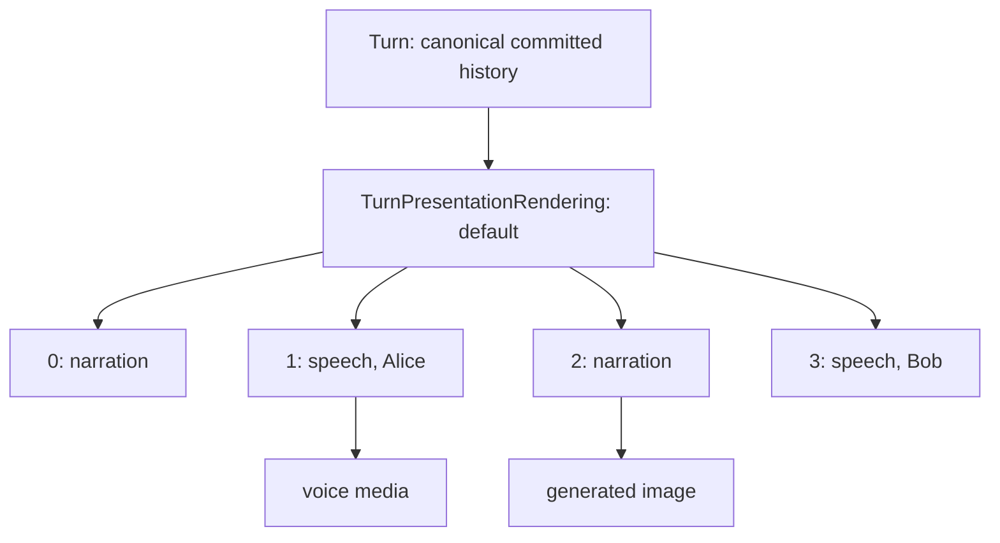

# Turn 呈现

一个 canonical turn 是模拟历史中一个已提交单元。前端不必把这个 turn 渲染成一个气泡。世界模拟引擎保存了一个独立、非权威的 presentation layer，可以把一个 turn 拆成有序 display blocks。

关键模型包括：

| 模型 | 用途 |
| --- | --- |
| `Turn` | Canonical record：sequence、type、content 和 start time。 |
| `TurnPresentationBlock` | 一个 turn 的一个有序显示片段。 |
| `TurnPresentationRendering` | 某个 turn 的 locale/rendering-specific 有序 block 集合。 |
| `PresentedTurn` | API projection，返回 canonical turn 和所选 presentation blocks。 |

Presentation blocks 永远不携带模拟权威。它们用于渲染、语音、图像、streaming 状态和替代显示变体。

## Block 类型

`PresentationBlockType` 支持：

| 类型 | 前端处理 |
| --- | --- |
| `action` | 用户动作气泡，包括格式化后的用户文本。 |
| `speech` | 带 speaker attribution 和头像的角色发言气泡。 |
| `narration` | 叙事 card/bubble。 |
| `thought` | 样式化 internal thought block。 |
| `system_notice` | 系统提示 block。 |
| `media` | 媒体 placeholder/block。 |

模型会强制非 media blocks 必须有 text，media blocks 必须有 `media_id`，speech blocks 必须有 speaker attribution，并且 block sequence numbers 必须连续。

## 为什么一个 turn 会变成多个气泡

Narrator 返回结构化 narration blocks。提交期间，`WorldSimulator._store_default_presentation` 会把每个 narration 或 speech block 存为 `TurnPresentationBlock`。因此，一个 turn 可能渲染为：

- 一段介绍结果的 narration；
- Alice 的一个 speech bubble；
- 描述动作的一段 narration；
- Bob 的一个 speech bubble；
- 链接到某个具体 block 的生成场景图。

这有意不同于把 canonical state 存成格式化聊天文本。turn 仍然是用于 sequencing、audit、regeneration 和 time advancement 的单个模拟事件，而 UI 可以渲染出自然对话。

## API 和 fallback 行为

Turn API 暴露：

- `/turn-presentations`：列出带 presentation blocks 的 turns；
- `/turns/{turn_id}/presentation`：获取一个 presented turn；
- `/turns/{turn_id}/presentation/{rendering_id}`：替换一个 rendering；
- 图像和语音端点：把生成媒体附加到整个 turn 或某个 presentation block。

如果一个 turn 没有已存 presentation blocks，后端会创建 legacy presentation projection：

- 用户 turns 变成一个 `action` block；
- JSON `NarrationProposal` content 变成其中的 narration/speech blocks；
- plain text 系统输出变成一个 `narration` block。

这样旧 turns 仍然可以渲染，而新 turns 使用显式 presentation data。

## 前端渲染

`SimulationChatPage` 会优先使用存在的 `narration_blocks`。它把 blocks 映射到专门组件：

- `SpeechBlockMessage` 渲染角色发言，带 speaker avatar、分段语音控制和角色环境肖像生成。
- `UserActionBlockMessage` 渲染用户动作文本，并可以为该 block 请求场景图。
- `NarrationCardBlockMessage` 渲染 narration、thought、system notice、action 或 media blocks，并可以为 narration 请求场景图。

当存在 block presentation 时，图像按 block 加载；对于 legacy single-bubble turns，图像按整个 turn 加载。语音控制按 narration/speech block 操作，因此 TTS 可以把一个 turn 配成多个自然音频片段，而不是一整段长独白。
